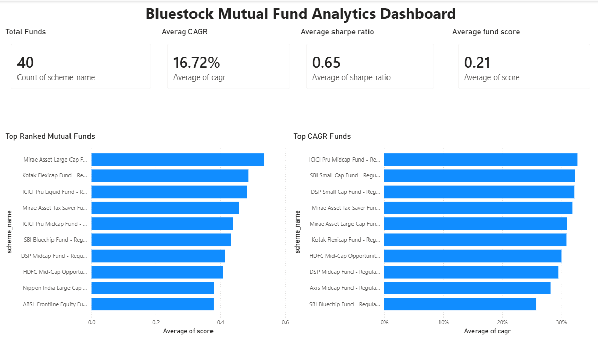
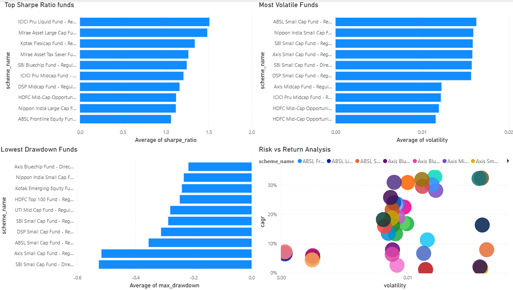
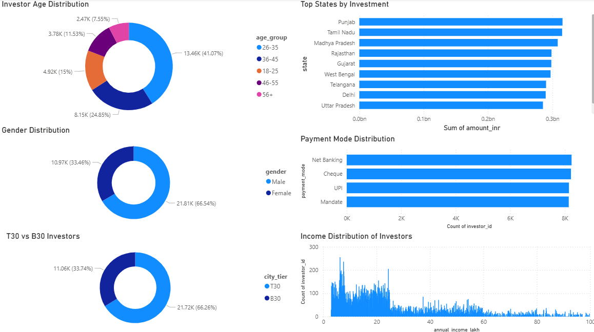
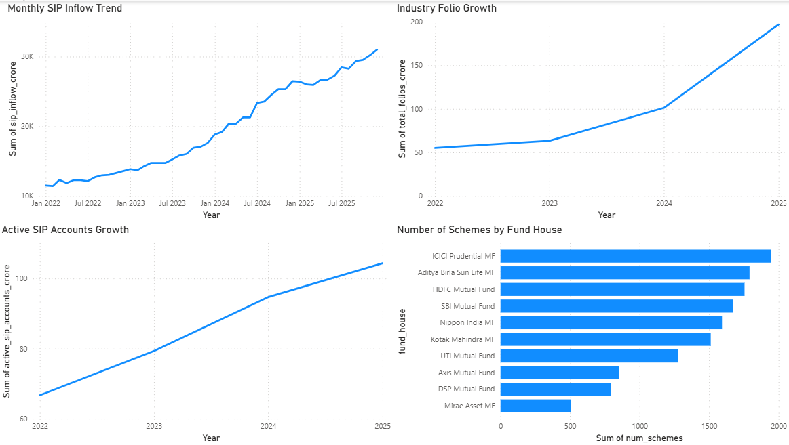

# 📊 Mutual Fund Analytics & Investor Insights Platform

## 🚀 Project Overview

The Mutual Fund Analytics & Investor Insights Platform is an end-to-end data analytics project developed to analyze mutual fund performance, investor behavior, and industry trends.

The project covers the complete analytics lifecycle:

- Data Ingestion
- Data Cleaning & Validation
- Database Design using SQLite
- SQL Analysis
- Exploratory Data Analysis (EDA)
- Financial Performance Analytics
- Advanced Risk Analytics
- Interactive Power BI Dashboard

The goal is to help investors and fund managers make data-driven decisions using key financial and behavioral insights.

---

# 🛠 Tech Stack

### Programming & Analytics
- Python
- Pandas
- NumPy

### Database
- SQLite
- SQL

### Visualization
- Matplotlib
- Seaborn
- Power BI

### Development Tools
- PyCharm
- Jupyter Notebook
- Git & GitHub

---

# 📂 Project Structure

```text
Bluestock_Capstone/
│
├── data/
│   ├── raw/
│   ├── processed/
│   ├── analytics/
│   └── db/
│
├── notebooks/
│   ├── 01_data_ingestion.ipynb
│   ├── 03_eda_analysis.ipynb
│   └── Advanced_Analytics.ipynb
│
├── scripts/
│   ├── data_ingestion.py
│   ├── live_nav_fetch.py
│   ├── clean_nav_history.py
│   ├── clean_transactions.py
│   ├── clean_scheme_performance.py
│   ├── create_database.py
│   ├── load_to_database.py
│   ├── run_queries.py
│   ├── var_cvar_analysis.py
│   ├── rolling_sharpe.py
│   ├── cohort_analysis.py
│   ├── sip_continuity.py
│   ├── recommender.py
│   └── sector_hhi.py
│
├── sql/
│   ├── schema.sql
│   └── queries.sql
│
├── dashboards/
│   └── Bluestock_MutualFund_Dashboard.pbix
│
├── reports/
│   ├── data_dictionary.md
│   ├── day3_eda_report.md
│   ├── day5_powerbi_report.md
│   └── Final_Report.md
│
├── README.md
└── requirements.txt
```

---

# 📈 Datasets Used

The project uses 10 mutual fund industry datasets:

| Dataset | Description |
|----------|-------------|
| Fund Master | Basic mutual fund information |
| NAV History | Historical NAV values |
| AUM by Fund House | Assets Under Management |
| Monthly SIP Inflows | SIP industry growth |
| Category Inflows | Category-wise investment flows |
| Industry Folio Count | Investor folio statistics |
| Scheme Performance | Returns and risk metrics |
| Investor Transactions | Investor purchase/redemption activity |
| Portfolio Holdings | Fund portfolio composition |
| Benchmark Indices | Market benchmark performance |

---

# 🔄 Data Pipeline

```text
Raw Data
    ↓
Data Cleaning
    ↓
SQLite Database
    ↓
SQL Analysis
    ↓
EDA & Visualization
    ↓
Financial Analytics
    ↓
Advanced Analytics
    ↓
Power BI Dashboard
```

---

# 🧹 Data Cleaning

Performed:

- Missing value analysis
- Duplicate record detection
- Invalid NAV checks
- Invalid transaction checks
- Date formatting
- Data type conversion
- Forward filling missing NAV values

Output:

```text
data/processed/
```

contains cleaned datasets.

---

# 🗄 Database Design

SQLite database created using a Star Schema.

### Tables

#### Dimension Table

- dim_fund

#### Fact Tables

- fact_nav
- fact_transactions
- fact_performance

Database file:

```text
data/db/bluestock_mf.db
```

---

# 📊 Exploratory Data Analysis

Performed analysis on:

- SIP growth trends
- Industry folio growth
- Fund house AUM comparison
- Category inflows
- Portfolio sector allocation
- Investor demographics
- Fund correlations

Generated 15+ visualizations using:

- Matplotlib
- Seaborn

---

# 💰 Financial Analytics

Developed key mutual fund performance metrics:

### CAGR

Measures annualized growth rate of investment.

### Volatility

Measures return fluctuations and risk.

### Sharpe Ratio

Measures risk-adjusted return.

### Maximum Drawdown

Measures largest historical loss from peak.

### Composite Fund Score

Created a ranking score based on:

- CAGR
- Sharpe Ratio
- Drawdown

Output:

```text
data/analytics/fund_analytics_final.csv
```

---

# 📉 Advanced Analytics

Implemented advanced financial risk analysis.

### Value at Risk (VaR)

95% Historical VaR estimation.

### Conditional VaR (CVaR)

Expected loss beyond VaR threshold.

### Rolling Sharpe Ratio

90-day rolling risk-adjusted performance.

### Investor Cohort Analysis

Grouped investors by first investment year.

### SIP Continuity Analysis

Identified investors at risk of SIP discontinuation.

### Fund Recommendation Engine

Suggested funds based on investor risk profile.

### Sector Concentration Risk

Calculated Herfindahl-Hirschman Index (HHI).

---

# 📊 Power BI Dashboard

Developed a 4-page interactive dashboard.

---

## Page 1 – Executive Overview

KPIs:

- Total Funds
- Average CAGR
- Average Sharpe Ratio
- Average Fund Score

Visuals:

- Top Ranked Funds
- Top CAGR Funds

---

## Page 2 – Fund Performance

Visuals:

- Top Sharpe Ratio Funds
- Most Volatile Funds
- Lowest Drawdown Funds
- Risk vs Return Analysis

---

## Page 3 – Investor Insights

Visuals:

- Age Distribution
- Gender Distribution
- State-wise Investments
- Payment Mode Analysis
- Income Analysis
- T30 vs B30 Investors

---

## Page 4 – Industry Trends

Visuals:

- SIP Inflow Trend
- Active SIP Accounts Growth
- Industry Folio Growth
- Fund House Comparison
- Scheme Distribution

---

# 🔍 Key Insights

### Fund Performance

- Equity funds generated the highest CAGR.
- Higher returns generally came with higher volatility.
- Sharpe Ratio helped identify efficient funds.

### Investor Behavior

- Majority of investors belong to T30 cities.
- SIP remains the preferred investment route.
- Investors with higher income tend to invest larger amounts.

### Industry Trends

- SIP inflows have shown strong year-on-year growth.
- Industry folio count continues to expand steadily.
- Large fund houses dominate industry AUM.

---

# ▶️ How to Run

### Install dependencies

```bash
pip install -r requirements.txt
```

### Run data cleaning

```bash
python scripts/clean_nav_history.py
python scripts/clean_transactions.py
python scripts/clean_scheme_performance.py
```

### Create database

```bash
python scripts/create_database.py
python scripts/load_to_database.py
```

### Run analytics

```bash
python scripts/run_queries.py
python scripts/var_cvar_analysis.py
python scripts/rolling_sharpe.py
```

### Open Dashboard

```text
dashboards/Bluestock_MutualFund_Dashboard.pbix
```

using Power BI Desktop.

---

# 🎯 Project Outcomes

✔ Built an end-to-end analytics pipeline

✔ Processed and analyzed mutual fund industry datasets

✔ Developed advanced financial risk metrics

✔ Designed an interactive Power BI dashboard

✔ Generated actionable investment insights

✔ Created a portfolio-ready analytics project

---

# 👨‍💻 Author

**Sumit Sinha**

Data Analytics | Business Analytics | Financial Analytics

GitHub: [https://github.com/your-github-profile](https://github.com/Sumit21Sinha)

LinkedIn: [https://linkedin.com/in/your-linkedin-profile](https://www.linkedin.com/in/sumit-sinha-454a232a6/)

---

# ⭐ Acknowledgements

Developed as part of the Bluestock Mutual Fund Analytics Capstone Project.
